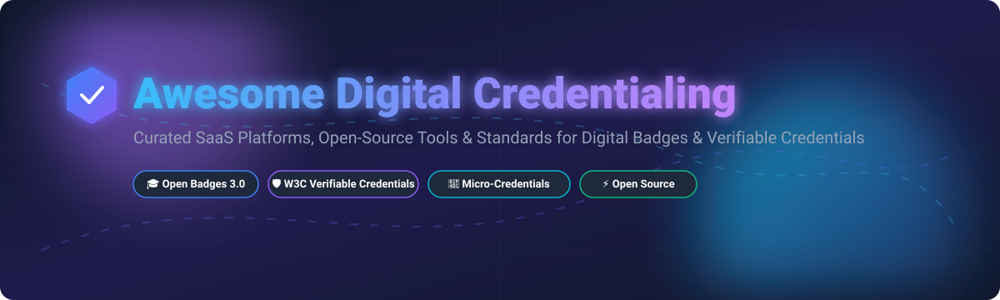

  

  
  
  
  
  

---

# 🎓 Awesome Digital Credentialing 📜

> **A curated directory of top SaaS platforms, open-source GitHub projects, developer SDKs, and industry standards for Digital Credentials, Open Badges 3.0, W3C Verifiable Credentials (VCs), Micro-Credentials, and Digital Certificate Verification.**

Welcome to the ultimate resource for **Digital Credentialing**. Whether you are an educator, enterprise, workforce development provider, or software engineer building verifiable credential wallets, this guide provides comprehensive insights into commercial SaaS platforms and open-source infrastructure.

---

## 📌 Table of Contents

- [📊 Sector Overview & Market Dynamics](#-sector-overview--market-dynamics)
- [🏢 SaaS & Hosted Digital Credential Platforms](#-saas--hosted-digital-credential-platforms)
- [⚡ Open-Source GitHub Repositories](#-open-source-github-repositories)
- [🛡️ Key Industry Standards & Protocols](#️-key-industry-standards--protocols)
- [🤝 How to Contribute](#-how-to-contribute)
- [💖 Support & Sponsorship](#-support--sponsorship)
- [📈 Star History](#-star-history)
- [⚖️ Disclaimer](#️-disclaimer)

---

## 📊 Sector Overview & Market Dynamics

> 💡 **Market Size & Industry Structure:**  
> The global **Digital Credentialing & Verifiable Micro-Credentials Sector** was valued at **~$3.2 Billion in 2024** and is projected to expand to **~$8.5 Billion by 2030 (CAGR ~17.8%)**.  
> **Market Fragmentation:** The sector is **moderately fragmented**. Established enterprise titans (such as Instructure Canvas Credentials and Pearson Credly) hold dominant market shares in higher-education and corporate workforce accreditation. Concurrently, a vibrant ecosystem of specialized SaaS providers (Accredible, Certifier, Virtualbadge.io) and open-source Decentralized Identity (SSI) frameworks compete actively on API-first developer workflows, pricing agility, and W3C Verifiable Credential compliance.

---

## 🏢 SaaS & Hosted Digital Credential Platforms

Below is a curated comparison table of leading hosted digital credentialing and certificate issuance SaaS products, sorted by **Company Size / Revenue / Valuation (Descending)**.

| 🏢 Platform & Link | 📝 Overview & Key Focus | 💵 Starting Tier Price | 🎁 Free Tier / Trial Limits | 📊 Company Size / Valuation / Revenue |
| :--- | :--- | :--- | :--- | :--- |
| **[Canvas Credentials (Instructure)](https://www.instructure.com/canvas/credentials)** | Enterprise LMS badge & micro-credential platform (formerly Badgr Pro), deeply integrated with Canvas LMS. | **$2,400 / year** *(Pro edition starting price)* | **14-day free trial** *(Canvas Badges Free edition available for basic LMS use)* | **~$3.5B+ Market Cap**   *(Parent Instructure: $500M+ ARR)* |
| **[Credly (Pearson)](https://www.credly.com/)** | Industry-standard enterprise digital badge marketplace and credential verification network for tech & corporate giants. | **$2,500 / year** *(Base enterprise quote)* | **14-day admin trial** *(Demo sandbox upon enterprise request)* | **~$200M+ Acquisition**   *(Acquired by Pearson; ~$50M ARR)* |
| **[Accredible](https://www.accredible.com/)** | Market-leading digital certificate & badge issuer with automated design engines, LinkedIn sharing, and analytics. | **$45 / month** *($540 billed annually for Launch plan)* | **14-day free trial** *(Issue up to 20 recipient credentials)* | **~$100M+ Valuation**   *(~$15M+ ARR, 200+ employees)* |
| **[Certifier](https://certifier.io/)** | Modern, intuitive certificate & digital badge creator with built-in email automation and PDF builder. | **$76 / month** *(Professional plan, billed annually)* | **Forever Free Plan** *(Issue up to 250 credentials/year)* | **~$2M - $5M ARR**   *(~$1M+ VC funding raised)* |
| **[Sertifier](https://sertifier.com/)** | Automated credential distribution platform with skill mapping, smart analytics, and LMS integrations. | **$49 / month** *(Basic tier)* | **14-day free trial** *(Full access to design & test issuance)* | **~$2M ARR**   *(Venture-backed startup)* |
| **[Open Badge Factory](https://openbadgefactory.com/)** | European Open Badges pioneer designed for educational institutions, non-profits, and modular badge systems. | **€220 / year** *(~$240/year Basic plan)* | **60-day free trial** *(Pro features, max 50 issuances/day)* | **~$1M - $3M ARR**   *(Bootstrapped & profitable, 10+ yrs)* |
| **[Virtualbadge.io](https://www.virtualbadge.io/)** | GDPR-compliant European badge generator focusing on high social media viral sharing for course creators. | **$26 / month** *(Lite annual subscription)* | **7-day free trial** *(Issue 20 test certificates)* | **~$1M - $3M ARR**   *(Backed by Start-up BW & NEXT Mannheim)* |
| **[VerifyEd](https://www.verifyed.io/)** | Blockchain-anchored digital certificate & badge issuing platform ensuring tamper-proof academic verification. | **£49 / month** *(~$64/month entry tier)* | **14-day free trial** *(Access to test issuer portal)* | **~$1M - $2M ARR**   *(Seed-funded EdTech startup)* |
| **[Certopus](https://certopus.com/)** | AI-assisted digital certificate & badge issuing platform with bulk generation and verification portals. | **$14.99 / month** *(Starter paid tier)* | **Free Starter Plan** *(Issue 250 credentials/year free)* | **~$1M ARR**   *(Raised $55K+ via gBETA & Wise Guys)* |
| **[CanCred](https://cancred.ca/)** | Canadian digital credentialing service built on Open Badge Factory tech for regional learning networks. | **$300 / year** *(Personal/Small Org tier)* | **30-day free trial** *(Full access to CanCred Factory)* | **<$1M ARR**   *(Regional Canadian provider)* |

---

## ⚡ Open-Source GitHub Repositories

Explore active open-source repositories for building custom Open Badges 3.0 issuers, W3C Verifiable Credentials wallets, DID protocols, and verification engines. Sorted by **GitHub Stars (Descending)**.

| 📦 Repository & Project | ⭐ GitHub Stars | 📖 Description & Standards Supported |
| :--- | :--- | :--- |
| **[moodle/moodle](https://github.com/moodle/moodle)** |  | World's leading open-source Learning Management System (LMS) featuring native Open Badges 2.0 & 3.0 issuance capabilities. |
| **[hyperledger/aries-cloudagent-python](https://github.com/hyperledger/aries-cloudagent-python)** |  | Foundation framework for trust agent issuance, verification, and SSI key management for W3C Verifiable Credentials. |
| **[decentralized-identity/veramo](https://github.com/decentralized-identity/veramo)** |  | JavaScript framework for Decentralized Identity (DID) and W3C Verifiable Credentials handling across Node.js and React Native. |
| **[blockchain-certificates/cert-issuer](https://github.com/blockchain-certificates/cert-issuer)** |  | Reference open-source Blockcerts code for issuing credentials and anchoring cryptographic hashes on Ethereum & Bitcoin. |
| **[1EdTech/openbadges-specification](https://github.com/1EdTech/openbadges-specification)** |  | Official 1EdTech standard specification data models and JSON-LD schemas for Open Badges 2.0 and 3.0. |
| **[blockchain-certificates/cert-verifier-js](https://github.com/blockchain-certificates/cert-verifier-js)** |  | JavaScript library for client-side parsing and verification of Blockcerts digital credentials. |
| **[learningeconomy/LearnCard](https://github.com/learningeconomy/LearnCard)** |  | Universal open-source credential wallet, core SDK, and plugin stack for Open Badges 3.0 & W3C Verifiable Credentials. |
| **[walt-id/waltid-identity](https://github.com/walt-id/waltid-identity)** |  | Open-source enterprise Self-Sovereign Identity (SSI) and Verifiable Credential infrastructure suite (Kotlin/Java & TypeScript). |
| **[digitalcredentials/learner-credential-wallet](https://github.com/digitalcredentials/learner-credential-wallet)** |  | Mobile wallet application developed by the Digital Credentials Consortium for holding academic verifiable credentials. |
| **[1EdTech/openbadges-validator-core](https://github.com/1EdTech/openbadges-validator-core)** |  | Official 1EdTech validation engine for checking Open Badges payload compliance against specs. |

---

## 🛡️ Key Industry Standards & Protocols

Interoperability in digital credentialing relies on open specifications:

1. **🎓 Open Badges 3.0 (1EdTech / IMS Global):** Aligns badge data modeling directly with W3C Verifiable Credentials schema specifications for universal portability.
2. **🔐 W3C Verifiable Credentials Data Model v2.0:** Expresses tamper-evident digital credentials cryptographically signed using Decentralized Identifiers (DIDs).
3. **⛓️ Blockcerts Standard:** Open standard developed by MIT Media Lab and Learning Machine for blockchain-anchored certificates.

---

## 🤝 How to Contribute

Contributions are warmly welcome! Help make this curated list the best reference for digital credentialing.

1. Fork the repository.
2. Create your feature branch (`git checkout -b feature/add-credential-tool`).
3. Edit `README.md` adding your project (keep descriptions objective and include links).
4. Commit your changes (`git commit -m 'Add new open-source credential verifier'`).
5. Push to the branch (`git push origin feature/add-credential-tool`).
6. Open a Pull Request.

Make sure to check our master collection at [Awesome-Awesome-Awesome](https://github.com/ishandutta2007/Awesome-Awesome-Awesome)!

---

## 💖 Support & Sponsorship

If you find this repository helpful in your digital credentialing or EdTech projects, please consider supporting the project:

- ⭐ **Star** this repository to increase visibility.
- 🍴 **Fork** it to keep your own copy or contribute updates.
- 📢 **Share** it with fellow developers, educators, and EdTech pioneers!
- ☕ **Buy Me a Coffee / Sponsor**: Support ongoing maintenance via the [GitHub Sponsor Dashboard](https://github.com/sponsors/ishandutta2007).

Thank you for being part of the open education and verifiable credential community! 🙌

---

## 📈 Star History

---

## ⚖️ Disclaimer

This repository is community-curated for informational purposes only. Mentions of SaaS providers or open-source software do not constitute an endorsement. Always conduct independent security and compliance audits before implementing credential verification tools in production.

---

  Made with ❤️ for educators, credential developers, and workforce innovators.

